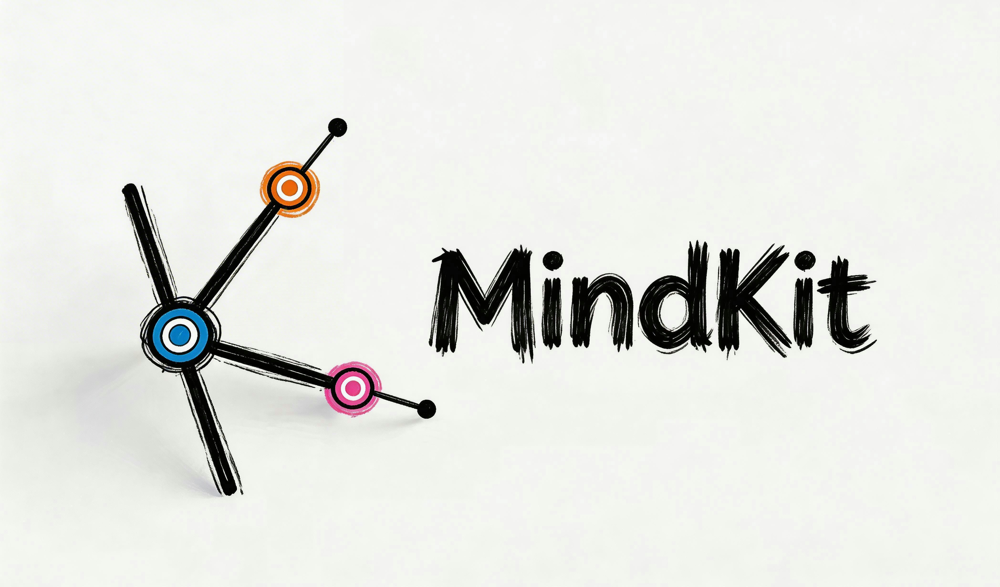

<p align="center">
  
</p>

<h3 align="center">AI 协作拓扑平台</h3>
<p align="center">让你与 AI 协作解决问题的过程变得有结构、能生长、可沉淀、可复用。</p>
<p align="center">不是帮你聊得更好，是给人与 AI 一个真正配得上复杂问题的协作框架。</p>
<p align="center">
  
</p>

---

## 我们解决了什么问题

今天所有 AI 对话产品的交互方式都是同一个东西：一个输入框，一条直线，从上往下滚。

但你的思维不是这样工作的。你跟 AI 聊一个复杂话题，话题分叉了，新想法蹦出来，你不敢岔开——因为岔开了上下文就乱了。你忍住，那个想法就没了。

每个人跟 AI 深度协作时都有点"ADHD"——不是你有问题，**是工具有问题**。

| 现在的问题 | MindKit 的解法 |
|---|---|
| 对话越长，上下文越稀释 | 每个节点独立上下文，互不干扰 |
| 多个话题挤在一个窗口互相污染 | 话题分叉时自动分裂成独立节点 |
| 关掉窗口什么结构都没留下 | 思维结构以拓扑图持久保存 |
| 几天后想继续，完全接不上 | Session 记忆管理，随时恢复任意分支 |
| 聊了两小时只剩一堆聊天记录 | 产物视图将对话沉淀为可交付成果 |
| 每次都要从零开始 | Kit Market 提供可复用的协作模板 |

---

## 产品是什么

MindKit 把线性对话炸开成一张**可生长的认知拓扑网络**，让每一次与 AI 的深度协作都有结构、有产出、可复用。

### 三大核心机制

**对话自动分裂**
话题分叉时，AI 自动识别语义并创建新节点。每个节点有独立上下文，互不干扰。你的思维自然生长，系统跟着长。

**全局意识整合**
一个主意识层跨所有节点工作，感知分支之间的冲突和依赖，主动推送洞察。A 分支的决定和 B 分支矛盾，系统会告诉你。

**产物汇聚**
整张拓扑网络最终可汇聚为结构化产物——PRD、商业计划、训练方案、学习路径……不只是聊天记录。

### 三大模块

**Kit Space — 个人思维空间**
围绕一个主题创建 Kit，与 AI 协作，对话自动分裂成拓扑网络。左侧对话，右侧实时生长的节点图，最终切换到产物视图获取交付物。

**Kit Market — 协作模板市场**
浏览和 Fork 他人的 Kit。一个"留学规划 Kit"预设了选校、文书、时间线等节点，Fork 过来，AI 带你逐个点亮，在这个框架上长出你自己的内容。站在别人经验的肩膀上。

**Kit Workshop — 模板创作工坊**
定义节点结构，配置 Agent 能力（tools / skills），设置引导路径，发布到 Market。你的方法论可以结构化地传给任何人。

### 双视图 · 双路径

|  | 视图 | 路径 |
|---|---|---|
| **结构** | 节点视图 — 看思维结构、关系和全局 | 从零自建 — 从一个主题出发，自由生长 |
| **产出** | 产物视图 — 直接可用的交付物 | Fork 模板 — 在专家预设的框架里逐步点亮 |

---

## 技术亮点

MindKit 构建了全新的 Agent Session 记忆管理机制，解决了三件难事：

- **语义级的对话分裂判断** — 什么时候该开新节点，不能错、不能乱
- **多 Session 之间的记忆一致性管理** — 节点摘要与全局状态的实时同步
- **跨节点的冲突感知与依赖追踪** — 全局意识层主动发现矛盾，而不是靠用户记

这套机制让 MindKit 不只是一个更好的聊天界面，而是重构了人与 AI 的协作范式。

---

## 适用场景

产品脑爆 → PRD · 商业规划 → BP · 留学申请 → 选校清单 · 投资研究 → 分析报告 · 知识体系构建 · 技能学习 · 个人成长规划

**任何需要"深度思考 + 体系构建"的场景。**

---

## 为什么值得做大

当 Kit Market 沉淀了足够多的 Kit，人类的经验和方法论**第一次被结构化地沉淀在一个网络里**，并且可以被 AI 驱动地复用。

这不是知识库——知识库是静态的。Kit 是活的。你 Fork 过来，AI 带你在这个框架里思考，你的思考长出新结构，改进后的版本可以再发布回去。经验在人和人之间流动，每流动一次都变得更好。

> **MindKit 的终极愿景：** 每个人都有自己的认知拓扑，它记录你思考过的一切，持续生长，随时可以接续。AI 是你的认知搭档，不只是问答机器。

---

## 技术栈

- TypeScript · pnpm monorepo · React · Vite · TailwindCSS
- 后端：Hono + WebSocket
- 存储：文件系统优先，本地持久化
- Agent 引擎：自研认知拓扑引擎（Session 分裂 · 记忆管理 · 全局意识整合）

## 快速开始

```bash
# Clone
git clone https://github.com/Eddiewjy/mindkit.git
cd mindkit

# 安装依赖
pnpm install

# 首次构建
pnpm build

# 启动开发服务器
pnpm dev
```

### 环境变量

```bash
cp .env.example .env
# 填入 API key
```

## 仓库结构

```
packages/
  server/            # 本地后端（Hono + WS）
  demo/              # 前端 Demo
market/presets/      # 内置预设配置
data/                # 运行时数据（gitignore）
```

## License

MIT
